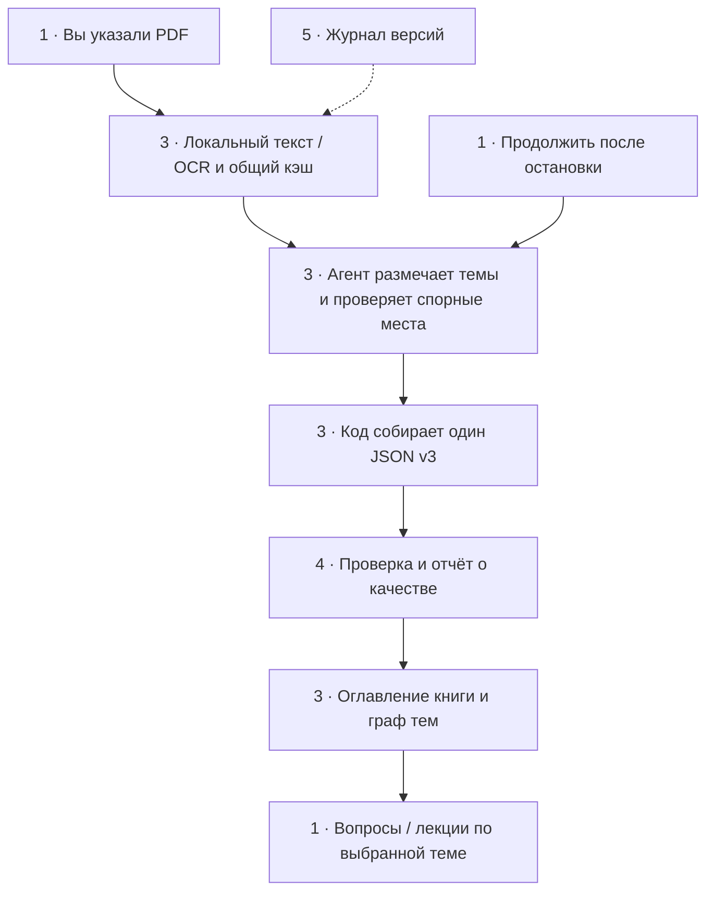

# Парсер учебников: запуск и журнал изменений

Версия 1.0.0 · 3 октября 2026 · статус: инструменты внедрены, полный книжный пилот ещё не выполнен.

## 1. Как запускать

Открой этот репозиторий в Cursor или Codex. Укажи PDF полным путём или через @.
Достаточно такой реплики:

> Используй скилл kz-textbook-parser версии 1.0.0 и PARSER_GUIDE.md.
> Распарси учебник @мой_учебник.pdf полностью в JSON v3.
> Используй локальный OCR и общий кэш, собирай тексты по ссылкам на блоки.
> Проверяй формулы, определения, задания и ответы по страницам PDF.
> Сохраняй прогресс, сделай оглавление с графом и сообщи оставшиеся сомнения.

Вместо @ можно написать: «PDF: D:\Учебники\Математика.pdf».
Не требуется вручную искать JSON, считать смещение страниц или запускать OCR.
Это работа агента. В русской книге он начнёт с rus, в казахской — с kaz+rus.

В Codex скилл лежит в .agents/skills, в Cursor — в .cursor/skills;
обе копии kz-textbook-parser одинаковые. Если редактор не подхватил скилл,
попроси явно прочитать соответствующий SKILL.md и следовать ему.

### Продолжение после остановки

> Продолжи парсинг того же PDF по ocr/jobs/<имя-книги>/progress.md.
> Сохрани уже готовую структуру и используй кэш, не начинай книгу заново.

В новом чате дай PDF и путь к job. Кэш текста восстанавливается автоматически
по содержимому PDF; решения о структуре восстанавливаются из structure.json
и progress.md. Важные записи нельзя оставлять только в истории разговора.
Не запускай двух агентов одновременно на запись одного structure.json.

### Работа с одной темой после парсинга

> Возьми тему «…» из <путь к parsed_v3.json>.
> Используй textbook-nav.js для выборки темы, не загружай всю книгу.

Для вопросов используй damulab-question-pipeline, для лекций —
damulab-lecture-pipeline. Полный парсинг для каждой новой темы повторять не нужно.
Аналитик проверяет только используемые неподтверждённые места, а не весь учебник.

## 2. Оглавление процесса

Граф — карта работы, а не дополнительный обязательный этап распознавания.
Номера узлов соответствуют разделам этого документа.



У каждой распарсенной книги агент создаёт своё оглавление:
toc.json для инструментов и toc.md с графом «книга → раздел → тема → страницы».
Граф не отправляет полный текст книги в модель и не ускоряет сам OCR;
экономия появляется при выборе нужной темы вместо перечитывания всего JSON.
Если редактор не отображает Mermaid, ниже графа книги остаётся обычная таблица.

## 3. Что агент делает и где результат

Один проход подготовки создаёт локальные тексты и изображения. Затем агент
порциями читает материал, определяет структуру и сохраняет небольшие ссылки:
например, «тема занимает блоки 2–20 страницы 9». Тексты по этим ссылкам
копирует программа, а не заново пишет модель.

| Файл / папка | Для чего |
|---|---|
| sources/<предмет>/<класс>/*.pdf | Исходник |
| ocr/cache/<SHA-256 PDF>/ | Текст, PNG, настройки OCR и карта страниц |
| ocr/jobs/<имя-книги>/index.json | Индекс подготовленных страниц |
| ocr/jobs/<имя-книги>/structure.json | Решения агента о темах/правилах/заданиях |
| ocr/jobs/<имя-книги>/progress.md | Где остановились и что делать дальше |
| ocr/jobs/<имя-книги>/metrics-*.json | Время и попадания в локальный кэш |
| ocr/jobs/<имя-книги>/validation.json | Результат структурной проверки |
| ocr/jobs/<имя-книги>/nav/toc.md | Оглавление и граф книги |
| parsed_outputs/<предмет>/<класс>/*_parsed_v3.json | Один итог: темы, тексты, правила, задания, качество |

Внутренние артефакты ocr/ игнорируются Git. Сохраняй их отдельно при переносе
работы на другую машину; push репозитория сам по себе не перенесёт прогресс.
Кэш относится к конкретным байтам PDF. Замена файла автоматически создаёт новый
кэш. Изменение языка, DPI, PSM или языковой модели создаёт другой OCR-профиль.

### Про полный путь и страницы — объяснение прежнего пункта №3

Ты уже правильно указывал файл. Поиск по репозиторию в таком случае не нужен.
Исправление касается агента: он обязан сразу использовать этот путь.
@ и обычный полный путь равноправны; в CLI передаётся сам путь без символа @.

Отдельная проблема — нумерация страниц: десятый лист PDF иногда является
восьмой страницей книги из-за обложки. Агент один раз проверяет это по PNG
и сохраняет соответствие. Это не новый способ указывать файл.
Если смещение меняется внутри книги, текущий сборщик не поддерживает такую
нумерацию: агент должен сообщить ограничение, а не подставить ошибочные номера.

## 4. Что означает качество

«Текст извлечён», «страница доступна» и высокий OCR-confidence не означают
«текст совпадает с учебником». Флаг verified появляется только после проверки
соответствующих блоков по изображению. Непроверенный текст остаётся medium.

Агент обязан сверить определения, формулы, даты/имена, условия задач и ответы,
таблицы и смешанные алфавиты. Обычный повествовательный текст проверяется
выборкой по разным макетам; обнаруженная систематическая ошибка расширяет
проверку на затронутый диапазон. Исправления имеют исходную строку и свидетельство,
сырой OCR не переписывается. Графические условия отмечаются отдельно, не выбрасываются.

Программа проверяет ссылки, структуру JSON и учёт каждого извлечённого блока.
Но она не может доказать, что OCR заметил все слова на странице или верно понял
таблицу. Полное покрытие PDF и полная визуальная проверка — разные вещи.
Частичная выгрузка помечается явно.

Не сохраняем старые ложные критерии: задание не обязано иметь четыре слова,
текст не обязан быть длиннее 500 символов, знак | может быть законным,
а одинаковое начало двух разных заданий не делает их дублями.
log-stats.py служит учёту, его «ошибок 0» не подтверждает качество парсинга.

## 5. Журнал версии 1.0.0

Изменения сделаны в коде и скиллах. Старые parsed_outputs и результаты прогонов
не переписаны. Ни коммита, ни push автоматически не сделано.

### 5.1. Извлечение текста

Было: инструкции ссылались на отсутствующий локальный tools/pdf-extract и
оставляли агенту выбор разрозненных способов извлечения.

Стало: версионируемые prepare/select/assemble/validate в content/tools.
PDF.js читает слой, локальный Tesseract распознаёт непригодные страницы.
Подготовка не вызывает языковую модель.

Зачем: OCR и копирование длинного текста не расходуют модельные токены.
Проверка и смысловая разметка остаются у агента.

### 5.2. Повторное OCR и копии страниц

Было: артефакты копировались в отдельные run; ссылки на старый кэш поддерживались
не полностью, параметры и источник было трудно сопоставить.

Стало: кэш по SHA-256 PDF, отдельные профили OCR, общий PNG, блокировки страницы
при одновременных запросах. Старые четыре варианта путей к кэшу поддержаны
как непроверенные подсказки. Для роли создаётся manifest со ссылками, не копии.

Зачем: повторная работа не распознаёт и не рендерит готовые страницы.
Чужой PDF или другой OCR-профиль не подмешивается молча.

### 5.3. Повторная запись длинных текстов

Было: модель формировала full_text и question_text, хотя текст уже существовал
в OCR. Это дополнительный вывод токенов и риск изменить символы при перепечатке.

Стало: агент пишет ссылки на блоки или компактные диапазоны; код копирует текст
в итог. Исправления после визуальной сверки записываются отдельно.

Зачем: меньше генерируемого текста и меньше ошибок перепечатки.
Это не запрет на полный текст: он по-прежнему содержится в итоговом JSON.

### 5.4. Большой контекст

Было: следующие роли должны были заново читать страницы и не учитывали full_text
новых JSON v3.

Стало: select выдаёт текст порциями с nextCursor, nav — одну тему.
Аналитик и лекционный парсер переиспользуют подтверждённые блоки того же PDF.

Зачем: в контекст попадает материал текущей задачи. Остаток порции не теряется.
Непроверенные цитаты всё равно проверяются по PNG.

### 5.5. Скорость локального OCR

Было: скилл не задавал единый управляемый способ подготовки; в лекционном парсере
требовался полный набор языков даже для русской страницы.

Стало: два локальных OCR-worker по умолчанию, каждый переиспользует свой
инициализированный движок. Языки выбираются по книге, дополнительных корпусов
без необходимости нет. workers можно настроить под память машины.

Зачем: меньше запусков движка и лишних моделей. Это локальные процессы, не
два платных агента. Больше workers не обязательно быстрее.

### 5.6. Честные критерии качества

Было: в основном скилле были пороги длины и ложный критерий log-stats;
слой с водяным знаком мог выглядеть как нормальный текст.

Стало: обнаружение OKULYK с произвольными пробелами, разделение доступности и
подтверждения, проверка происхождения/хешей, непотерянных частей блоков,
циклов тем, счётчиков и источников. Ответ задания участвует в его confidence.

Зачем: не ускоряем работу за счёт объявления непроверенного текста точным.
Короткие реальные задания не удаляются ради формальной проверки.

### 5.7. Скиллы и зависимости

Было: огромная схема внутри SKILL, устаревшие пути/утверждения о среде,
CommonJS-код в .js при type:module; жёсткая привязка OCR к названию модели.

Стало: общий parser-contract.md, одинаковые основные скиллы Cursor/Codex,
ESM-инструмент и совместимая .cjs-обёртка, parser-doctor.
Лекционный парсер и его вызов в оркестраторе используют выбранную пользователем модель, локальный OCR
не выдаётся за её способность. Для новых зависимостей закреплён pnpm-lock.yaml;
старый npm package-lock удалён и может быть восстановлен из Git.

Зачем: воспроизводимый запуск и меньше повторяющихся инструкций.
Рекомендации других моделей для остальных ролей лекционного пайплайна
этой доработкой не пересматривались.

### 5.8. Оглавление и продолжение

Было: структуру и точку остановки приходилось восстанавливать из истории.

Стало: toc.json/toc.md, structure.json и progress.md; один документ для инструкции
и журналов версий. Следующие изменения добавлять как новую версию ниже,
с форматом «было / стало / зачем / как проверено».

Зачем: навигация вместо повторного чтения, безопасное продолжение длинной работы.
Запись progress — обязанность агента, не отдельный автоматический парсер.

### Проверено 3 октября 2026

- Автотесты: 10/10. Водяной знак, старые поля, короткие задания, Unicode,
  точное копирование, неверный PDF/блок, изменение кэша, потеря хвоста,
  исправления по свидетельству, циклы, непроверенный ответ, компактные диапазоны.
  CLI-цепочка: порции с продолжением → сборка → проверка → граф;
  запрет неявной перезаписи и запуск обеих обёрток чтения.
- Реальный PDF: Алдамуратова, математика 5 класс, часть 1, физические страницы 9–13.
  Два worker, rus, 300 DPI, пустой отдельный кэш: 19,67 секунды на CLI целиком.
  Повтор той же команды: 0,37 секунды; 5 OCR-hit и 5 render-hit,
  новых OCR и рендеров — 0. Это небольшой локальный тест, не вся книга.
- На странице 9 визуально обнаружена ошибка OCR «83.» вместо «3.» несмотря
  на confidence 91. Поэтому число confidence не используется как допуск качества.
- Оглавление существующего JSON: 46 тем, выборка темы 1.2 и граф созданы.
- parser-doctor подтвердил зависимости и локальные rus/kaz модели этой машины.
- Дополнительно выполнен локальный OCR страницы 8 казахского учебника 2 класса
  с kaz+rus: подготовка 6,51 секунды. Это проверка запуска двух корпусов,
  не доказательство точности распознавания казахского текста.
- Штатный Python-валидатор скиллов не запустился: в bundled Python нет PyYAML.
  Заголовки, локальные ссылки и одинаковость двух основных SKILL проверяются
  отдельно; пакеты в пользовательскую среду ради этого не устанавливались.

### Что пока не измерено

Всю книгу новым агентным процессом ещё не проходили. Нельзя честно назвать
процент экономии пятичасового лимита или гарантировать улучшение качества
каждой книги. Нулевые llmTokens в metrics относятся только к локальной подготовке,
не к работе агента. Реальные токены/лимит фиксируются по статистике редактора,
а не вычисляются по длине текста.

Следующий контроль — одна полная книга с учётом входных/выходных токенов,
общего времени и эталонной проверкой одинаковых страниц до/после.
Сравнить охват всех страниц/тем/заданий, точность цитат/формул, число дублей
и нерешённых мест. Старые JSON не заменять, пока новый результат не прошёл
этот контроль. Использование процентов квоты вместо токенов даёт только
приближённое сравнение, особенно если редактор объединяет несколько моделей.

## 6. Технический запуск — только если нужен вручную

На этой машине bundled runtime уже найден, подготовка проверена.
На другой нужны Node >=22.13, pnpm, Poppler/pdftoppm и локальные языковые
rus.traineddata/kaz.traineddata (в репозитории сейчас есть обе).
Не выполняется скрытая загрузка OCR-моделей по сети.

Команды из корня репозитория:

```powershell
pnpm --dir content/tools install --frozen-lockfile
node content/tools/parser-doctor.js
node content/tools/prepare-textbook.js --pdf "D:\Учебники\Математика.pdf" --out "ocr/jobs/book" --pages all --ocr --lang rus --workers 2 --visual always --progress
node content/tools/select-textbook.js --index "ocr/jobs/book/index.json" --pages 9-16 --max-chars 16000 --out "ocr/jobs/book/packet.json"
```

Флаг --max-chars ограничивает текст символами, не токенами. Если nextCursor
не null, повтори select с тем же диапазоном и --cursor <nextCursor>.
JSON-обвязка пакета тоже занимает место в контексте.

После проверки печатных номеров повтори prepare с --set-offset N и
--mapping-evidence "какие две страницы проверены". Агент заполняет structure.json
по [контракту](content/parser-contract.md), затем:

```powershell
node content/tools/assemble-textbook.js --index "ocr/jobs/book/index.json" --plan "ocr/jobs/book/structure.json" --out "parsed_outputs/book_parsed_v3.json"
node content/tools/validate-textbook.js --parsed "parsed_outputs/book_parsed_v3.json" --out "ocr/jobs/book/validation.json"
node content/tools/textbook-nav.js --parsed "parsed_outputs/book_parsed_v3.json" --out "ocr/jobs/book/nav"
node --test content/tools/tests/textbook.test.js
```

Для зависимостей bundled runtime предусмотрен автоматический поиск рядом с
node.exe, либо KZ_PARSER_NODE_MODULES. Для Poppler — PATH или KZ_PDFTOPPM.
На новом компьютере, где модели лежат отдельно, используй --model-dir "<папка>".
Все инструменты имеют --help. Не включай --force-ocr для всей книги ради
исправления одной строки; перераспознай лишь плохие страницы в отдельном
диапазоне/индексе, затем заново подготовь общий индекс с нужным OCR-профилем.
