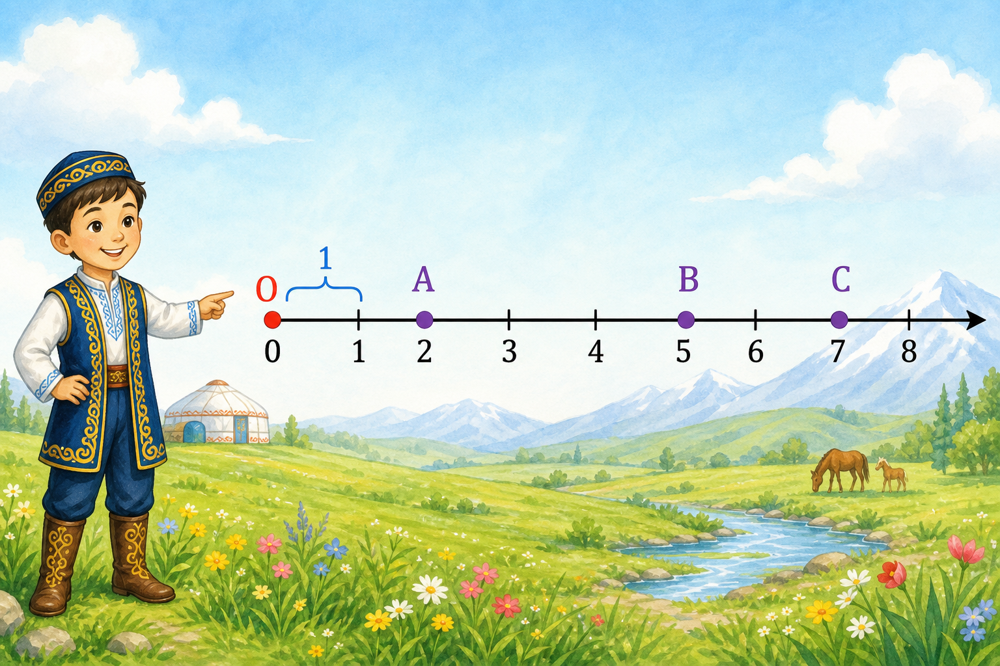
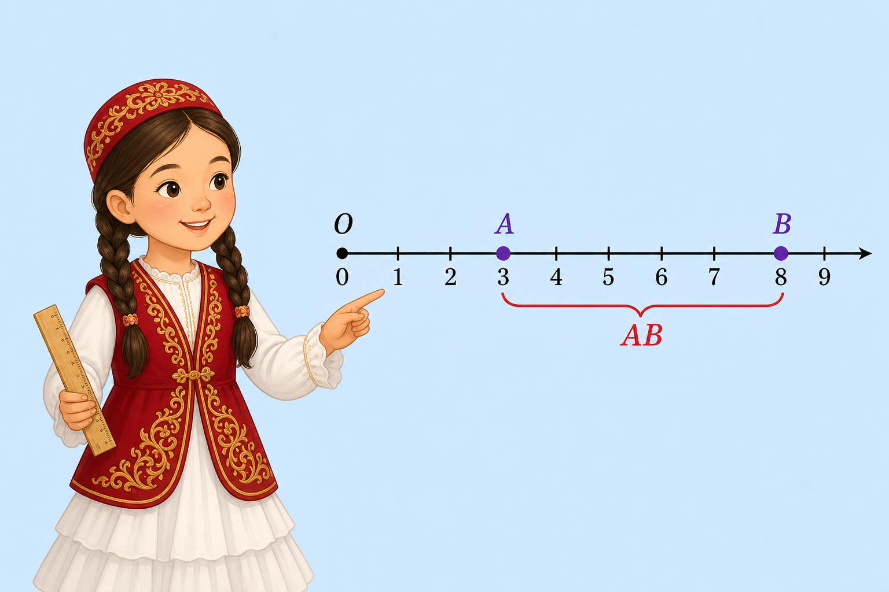
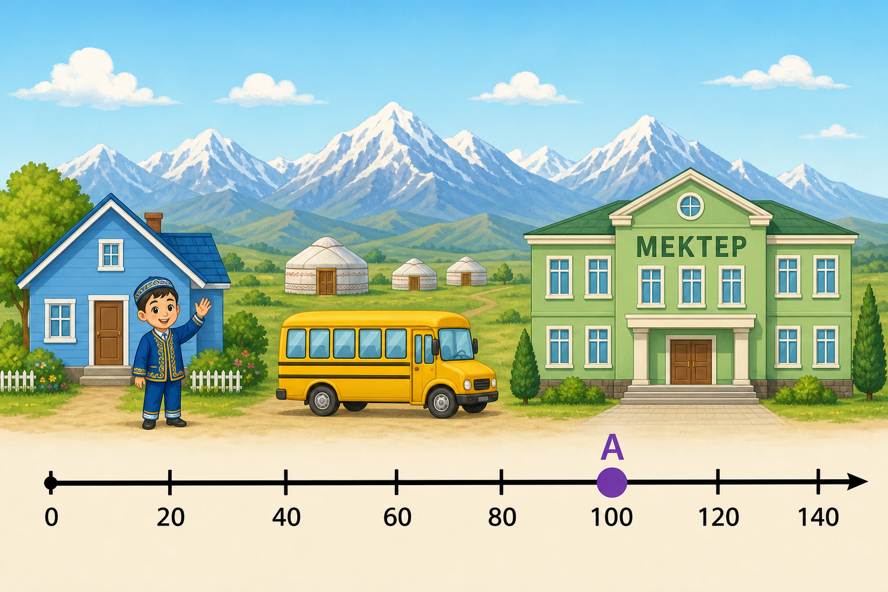
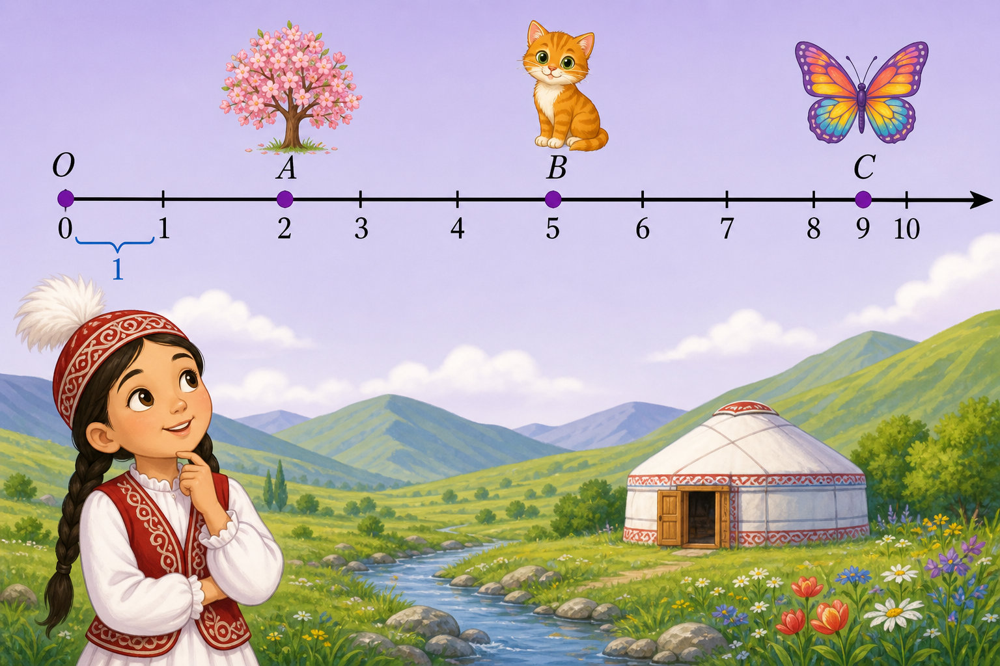
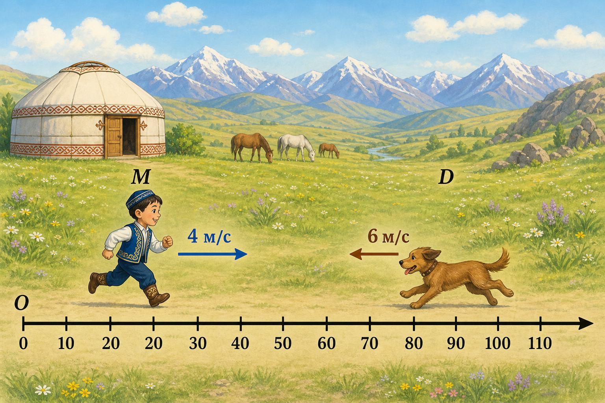

# Задачи по теме №3 «Координатный луч»

**Учебник:** Математика, Алдамуратова Т., 5 класс, Часть 1  
**Тема:** 1.2. Координатный луч. Изображение натуральных чисел и числа нуль на координатном луче  
**Страницы учебника:** 9–12  

Из 5 заданий: **3 с одним правильным ответом** и **2 с несколькими правильными ответами**.  
В каждом задании **4 варианта ответа**.

---

## Задача 1 (один правильный ответ)

**Иллюстрация:** [./иллюстрации/zadacha_01.png](./иллюстрации/zadacha_01.png)

На рисунке мальчик показывает координатный луч.  
На луче отмечены точки **A**, **B** и **C**.  
Единичный отрезок показан синей скобкой между числами **0** и **1**.



**Вопрос.** Чему равна координата точки **B**?

**Варианты ответа:**

- А) 2  
- Б) 5  
- В) 7  
- Г) 8  

**Правильный ответ:** Б) 5  

### Решение

1. Начало луча — точка **O** с числом **0**.  
2. Синяя скобка между 0 и 1 — это **единичный отрезок**.  
3. Дальше вправо идут числа: 1, 2, 3, 4, 5, 6, 7, 8.

Смотрим на рисунок:

- точка **A** стоит над числом **2**;  
- точка **B** стоит над числом **5**;  
- точка **C** стоит над числом **7**.

Координата точки — это число этой точки.  
Значит, координата точки **B** равна **5**.

**Ответ:** Б) 5.

---

## Задача 2 (один правильный ответ)

**Иллюстрация:** [./иллюстрации/zadacha_02.png](./иллюстрации/zadacha_02.png)

На рисунке девочка с линейкой показывает координатный луч.  
На луче отмечены точки **A** и **B**.  
Красная скобка снизу обозначает отрезок **AB**.  
Длина единичного отрезка равна **1 см**.



**Вопрос.** Чему равна длина отрезка **AB**?

**Варианты ответа:**

- А) 3 см  
- Б) 5 см  
- В) 8 см  
- Г) 11 см  

**Правильный ответ:** Б) 5 см  

### Решение

По рисунку:

- точка **A** стоит над числом **3** → координата **A(3)**;  
- точка **B** стоит над числом **8** → координата **B(8)**.

Длина отрезка на координатном луче — это разность координат:

\[
8 - 3 = 5
\]

Единичный отрезок равен 1 см, поэтому длина **AB** равна **5 см**.

Проверка по рисунку: от 3 до 8 — это шаги 4, 5, 6, 7, 8. Всего **5** шагов.

**Ответ:** Б) 5 см.

---

## Задача 3 (один правильный ответ)

**Иллюстрация:** [./иллюстрации/zadacha_03.png](./иллюстрации/zadacha_03.png)

На рисунке:

- слева — **дом** и мальчик **Айдар**;  
- по дороге едет жёлтый **автобус**;  
- справа — школа (**MEKTEP**);  
- внизу — координатный луч с числами **0, 20, 40, 60, 80, 100, 120, 140**.

Дом находится у начала луча (число **0**).  
Школа отмечена точкой **A**.

Числа на луче показывают расстояние от дома в метрах  
(от одного числа до следующего — **20 метров**).



**Вопрос.** На каком расстоянии от дома находится школа?

**Варианты ответа:**

- А) 20 м  
- Б) 5 м  
- В) 100 м  
- Г) 140 м  

**Правильный ответ:** В) 100 м  

### Решение

1. Находим на рисунке точку **A** — она у школы.  
2. Точка **A** стоит ровно над числом **100**.  
3. Значит, координата школы равна **100**.  
4. Числа на луче даны в метрах, поэтому расстояние от дома до школы — **100 м**.

Другой способ:

- от 0 до 100 — это **5** шагов по лучу (20, 40, 60, 80, 100);  
- один шаг = 20 м;  
- \(5 \times 20 = 100\) м.

Почему другие ответы неверны:

- **20 м** — только один шаг на луче;  
- **5 м** — число шагов, но не расстояние;  
- **140 м** — самое правое число на луче, но школа там не стоит.

**Ответ:** В) 100 м.

---

## Задача 4 (несколько правильных ответов)

**Иллюстрация:** [./иллюстрации/zadacha_04.png](./иллюстрации/zadacha_04.png)

На рисунке координатный луч и три точки:

- **A** — у цветущего дерева;  
- **B** — у котёнка;  
- **C** — у бабочки.

Единичный отрезок показан синей скобкой между **0** и **1**.



**Вопрос.** Какие утверждения верны?  
Выбери **все** правильные ответы.

**Варианты ответа:**

- А) Координата точки B равна 5  
- Б) Точка A лежит левее точки B  
- В) Длина отрезка AB равна 7  
- Г) Длина отрезка AC равна 7  

**Правильные ответы:** А), Б), Г)  

### Решение

Считаем по рисунку от начала луча:

- дерево (**A**) — над числом **2** → **A(2)**;  
- котёнок (**B**) — над числом **5** → **B(5)**;  
- бабочка (**C**) — над числом **9** → **C(9)**.

**А)** Координата B равна 5 — **верно**.  

**Б)** Число 2 меньше 5, поэтому A левее B — **верно**.  

**В)** Длина AB: \(5 - 2 = 3\), а не 7 — **неверно**.  

**Г)** Длина AC: \(9 - 2 = 7\) — **верно**.

**Итог:** верны **А, Б и Г**.

---

## Задача 5 (несколько правильных ответов)

**Иллюстрация:** [./иллюстрации/zadacha_05.png](./иллюстрации/zadacha_05.png)

На рисунке мальчик **M** и собака **D** бегут навстречу друг другу по координатному лучу.

По рисунку видно:

- мальчик **M** находится над числом **20** и бежит вправо со скоростью **4 м/с**;  
- собака **D** находится над числом **80** и бежит влево со скоростью **6 м/с**;  
- числа на луче показывают расстояние в метрах.



**Вопрос.** Какие утверждения верны?  
Выбери **все** правильные ответы.

**Варианты ответа:**

- А) Координата мальчика равна 20, а координата собаки равна 80  
- Б) Расстояние между мальчиком и собакой равно 60 м  
- В) Они встретятся через 10 секунд  
- Г) Скорость сближения равна 10 м/с  

**Правильные ответы:** А), Б), Г)  

### Решение

**Шаг 1.** По рисунку: мальчик над **20**, собака над **80**.  
Утверждение **А верное**.

**Шаг 2.** Расстояние:

\[
80 - 20 = 60 \text{ м}
\]

Утверждение **Б верное**.

**Шаг 3.** Они бегут навстречу, поэтому скорости складываются:

\[
4 + 6 = 10 \text{ м/с}
\]

Утверждение **Г верное**.

**Шаг 4.** Время встречи:

\[
60 \div 10 = 6 \text{ с}
\]

Они встретятся через **6 секунд**, а не через 10.  
Утверждение **В неверное** (число 10 — это скорость сближения, а не время).

**Итог:** верны **А, Б и Г**.

---

## Краткая памятка для ученика

| Понятие | Что это значит |
|---|---|
| Начало координат | Точка O с числом 0 |
| Единичный отрезок | Одинаковый «шаг» на луче |
| Координата точки | Число этой точки на луче |
| Сравнение чисел | Большее число — правее, меньшее — левее |
| Расстояние между точками | Разность координат |

---

## Файлы

```
Математика/Задачи 5/
├── задачи_координатный_луч.md
└── иллюстрации/
    ├── zadacha_01.png
    ├── zadacha_02.png
    ├── zadacha_03.png
    ├── zadacha_04.png
    └── zadacha_05.png
```
